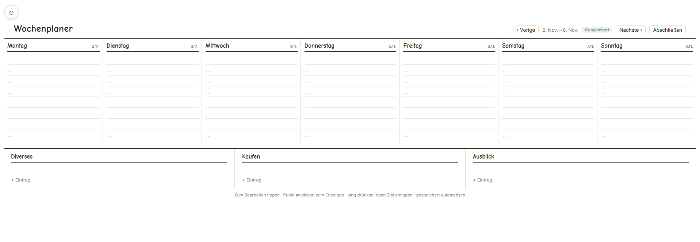

# Week Planner — Wochenplaner

A lightweight, paper-like weekly planning web app. Track appointments, a shopping list, miscellaneous tasks, and an outlook for the coming week. Data is persisted in MySQL through a small PHP backend.

> **Note:** The user interface is currently in German because the app was built for a German-speaking household. The code and this README are in English.



## Features

- 7 days with 8 appointment/task slots each
- Three note sections: **Diverses**, **Kaufen**, and **Ausblick**
- Status dots to mark entries as done
- Long-press an entry, then tap a target slot to move it within the same week or into another week
- Close a week: open **Kaufen** and **Diverses** items are carried over to the next week
- Optimistic locking with a conflict-resolution dialog when multiple devices edit the same week
- Auto-save with a status pill and a local backup of unsaved changes
- 90° rotation mode for tablets

## Tech stack

- PHP 8.x
- MySQL 8 / MariaDB (PDO MySQL extension)
- Vanilla JavaScript, HTML, CSS
- Docker Compose for local testing

## Quick start with Docker

1. Clone the repository.
2. Run:
   ```bash
   docker compose up --build
   ```
3. Open http://localhost:8080.

The database schema is imported automatically on the first start.

## Manual installation

1. Create a MySQL database and import the schema:
   ```bash
   mysql -u <user> -p <database> < schema.sql
   ```

2. Copy the configuration template and enter your database credentials:
   ```bash
   cp config.php.example config.php
   ```
   Or set the environment variables `DB_HOST`, `DB_NAME`, `DB_USER`, and `DB_PASS`.

3. Upload these files to the same directory on your web server:
   - `index.html`
   - `api.php`
   - `db.php`
   - `config.php` (if you created one)

4. Open the app through HTTP or HTTPS. It must be served from the same directory as `api.php`; opening `index.html` directly as a `file://` URL will not work because the browser's `fetch()` calls need an HTTP origin.


## Usage

- Tap an entry to open the edit dialog.
- Tap the dot next to an entry to toggle its done status.
- Long-press an entry for about 350 ms, then tap the target slot to move it.
- Use **Woche abschließen** to mark the current week closed and carry open shopping/misc items into the next week.

## Security note

There is **no built-in authentication**. Anything that can reach `api.php` can read and write all week data. Before exposing the app to the public internet, place it behind a reverse proxy, VPN, HTTP Basic Auth (e.g. `.htaccess`), or another access-control layer.

## API overview

- `GET api.php?week=YYYY-MM-DD` — load a week.
- `GET api.php?week=YYYY-MM-DD&revision_only=1` — lightweight revision poll.
- `POST api.php` with `{ week, days, notes, closed, base_revision }` — save a week.
- Stale writes return HTTP 409 with the current server state so the client can show a conflict dialog.

## Credits

This project was built with the coding assistance of:

- **Claude** by Anthropic
- **Kimi k2.7** by Moonshot AI
- **Cline** 

## License

MIT License — see [LICENSE](LICENSE).

